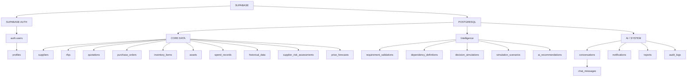

```mermaid
flowchart TD
    SUPABASE[SUPABASE]

    SUPABASE --> AUTH[SUPABASE AUTH]
    SUPABASE --> DB[POSTGRESQL]

    AUTH --> USERS[auth.users]
    USERS --> PROFILES[profiles]

    DB --> CORE[CORE DATA]
    DB --> INTEL[Intelligence]

    CORE --> SUPPLIERS[suppliers]
    CORE --> RFQ[rfqs]
    CORE --> QUOTATIONS[quotations]
    CORE --> PO[purchase_orders]
    CORE --> INVENTORY[inventory_items]
    CORE --> ASSETS[assets]
    CORE --> SPEND[spend_records]
    CORE --> HISTORY[historical_data]
    CORE --> RISK[supplier_risk_assessments]
    CORE --> FORECAST[price_forecasts]

    INTEL --> VALIDATION[requirement_validations]
    INTEL --> DEPENDENCY[dependency_definitions]
    INTEL --> SIMULATION[decision_simulations]
    INTEL --> SCENARIOS[simulation_scenarios]
    INTEL --> AI[ai_recommendations]

    DB --> SYSTEM[AI / SYSTEM]

    SYSTEM --> CONV[conversations]
    CONV --> MESSAGES[chat_messages]
    SYSTEM --> NOTIFICATIONS[notifications]
    SYSTEM --> REPORTS[reports]
    SYSTEM --> AUDIT[audit_logs]
```